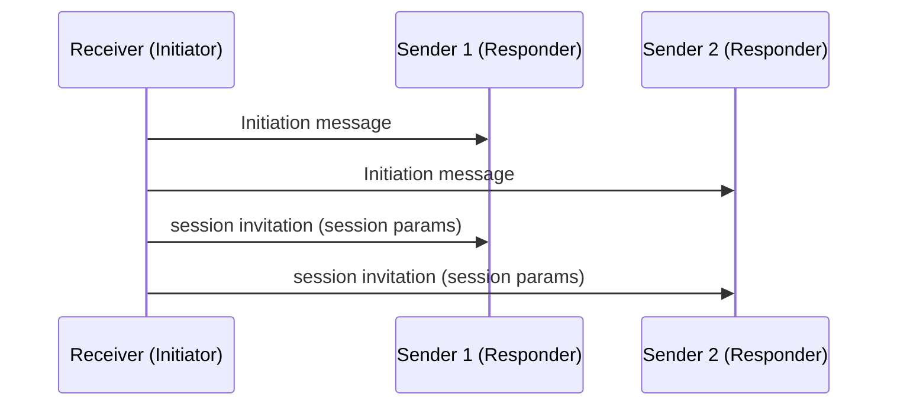
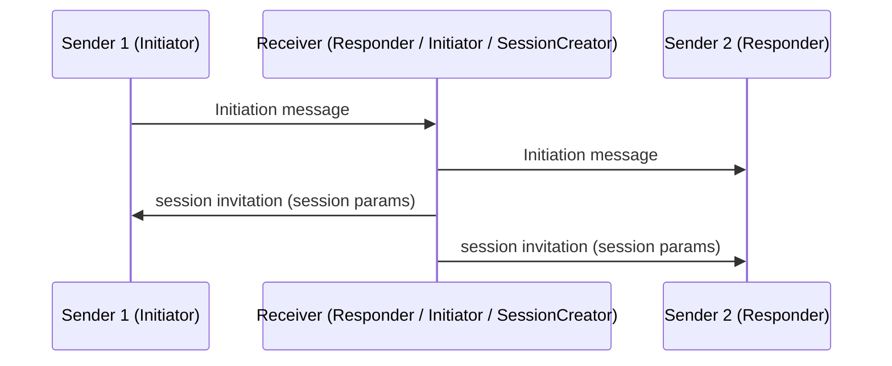

# Overview: Multiparty transaction construction in honest peer threat model

The following is a concrete description of the honest multiparty transaction construction protocol. To understand why certain design choices were made, read the [overview document](./00_overview.md) first.

## Motivation

This protocol is best understood as a collaborative transaction construction protocol for mutually trusting parties. Its purpose is to let participants jointly build a transaction with potentially better privacy properties and cost savings than a unilateral construction.

## Trust Model

Peers are trusted not to leak or retain their sensitive observations learned during the protocol, including timing, message ordering, and transport metadata (for example IP-layer linkability data) beyond what is needed to complete the session.

Importantly, fund safety does not depend on peer honesty. Each participant signs only a transaction they locally validate and accept under `SIGHASH_ALL`. Therefore, malformed or economically unacceptable constructions are treated as liveness failures, not fund-loss safety failures.

## Roles

### `Initiator` and `Responder`

The `Initiator` signals willingness to batch to their counterparty over an authenticated bidirectional channel that may have been established prior to initiation. This document treats signaling `mppj=1` via BIP321 as one practical bootstrap example, not a normative long-term mechanism. Either the receiver or sender of a payment may be the Initiator.

TODO: should we really define backwards compat?
If the Initiator is a receiver, they may also provide BIP77 payment instructions when the sender is not an upgraded client or when the receiver does not prefer a multi-party transaction. Older clients will ignore the `mppj=1` parameter and proceed with BIP-77.

The `Responder` is the counterparty who receives this signal. If a peer does not support the chosen multiparty signaling mechanism, it falls back to standard BIP77 behavior. If it does support the mechanism, it waits for a session to be created.

Two timeouts govern the phase of the whole protocol:

* `T_intent`: the absolute expiration time after which, if no session is created, both parties may fall back to standard BIP77 over their existing bidirectional channel. Since the intent can be delivered over an async channel, this is an absolute expiration, not a relative duration.
* `T_session`: the duration of the multiparty session itself, after which the session is considered expired. This is an optional field.

`T_session` is defined by the `SessionCreator` while `T_intent` is defined by the `Initiator`.

// TODO: specify a concrete signaling/payment-instructions format once requirements for PQ HPKE, sender initiation, and reusable authenticated channels are finalized

### `SessionCreator`

Either an `Initiator` or a `Responder` may create the session. The party that does so is the `SessionCreator`.

In production, we rarely observe multiple concurrent `Initiator` and `Responder` pairings. After `T_intent`, most multiparty payjoin attempts therefore collapse to two-party payjoins. Clients should persist multiparty capability metadata for counterparties learned during interactive sends. Each `Initiator` fans out session requests to `Responder`s with prior payment history. `Responder`s in turn can fan out requests to their previous counterparties.

The `SessionCreator` is responsible for creating session parameters (defined below), bootstrapping the transport mechanism and disseminating session information to the rest of the peers to the best of their capabilities. `SessionCreator` holds no special authority once the session is live. They simply become a participant.

### `Participant`

Once a party joins a session they become a `Participant`. All participants share the same obligations as outlined below in the phases section.

### Graph Model

Model peers as vertices of an undirected graph: each edge denotes an authenticated bidirectional channel between two peers. When one peer sends the initiation message, it orients that edge from `Initiator` to `Responder`. A `Responder` that fans out the request adds further directed edges along the same underlying channels. Any vertex in the connected component may become the `SessionCreator`.

Two or more vertices may concurrently assume the `SessionCreator` role.

TODO: concurrent session creators ? How to prevent? What to do?

* Deterministic rule for picking?
* Participate in both sessions?

### Diagrams

Single receiver, two senders. Receiver is `Initiator` for both senders and becomes the `SessionCreator`.

Sender 1 is the `Initiator` to the receiver who is an `Initiator` to sender 2. The receiver at time 3 becomes the `SessionCreator`.

## Session Parameters

The `SessionCreator` fixes the following parameters before the session opens. All participants must verify that the final transaction conforms to the relevant parameters before signing. Parameter values may also be specified as intervals where appropriate. Note that a size limit cannot be enforced: the `SessionCreator` only knows their immediate neighborhood of peers, and those peers may invite others.

* **Global transaction fields**: `nVersion`, `nLockTime` (time- or height-based)
* **Feerate**: each participant contributes fees proportional to the weight of their inputs and outputs
* **Input constraints**: `nSequence`, a list of allowed input types
* **Timeout**: `T_session` (optional)

## PSBT CRDT

### Join Semantics

Participants learn transaction fragments in arbitrary order and accumulate them as they arrive. In the honest setting there are no conflicting writes: session parameters fix global fields and each participant controls disjoint inputs and outputs. Any two valid fragments can therefore always be merged.

For this document, `balance` means the running value equation over the accumulated transaction view:

`balance = sum(inputs) - sum(outputs) - sum(pseudo outputs)`

If the accumulated transaction does not balance, or any fragment violates the session parameters, a participant can refuse to sign and abandon the session.

For more information, please refer to the [draft BIP](https://github.com/payjoin/multiparty-protocol-docs/pull/6).

## Communication model

The protocol assumes an abstract session-scoped broadcast channel for disseminating PSBT fragments.

**Required channel properties:**

All participants can publish protocol messages to the same "session channel", with messages authenticated and kept confidential within the participant set. Each participant is able to read and merge messages from all others into their own local transaction view. While message delivery may be delayed or received out of order, the protocol ensures eventual dissemination and reconciliation of all messages within the optional session window `T_session` if all parties behave honestly.

In this honest setting, a separate agreement protocol is not required for the success path. Gossip dissemination plus deterministic transaction construction is sufficient: if participants receive the same valid fragments, they converge to the same unsigned transaction. Any temporary view differences are primarily a liveness concern.

Candidate instantiations include [Iroh documents](https://docs.iroh.computer/protocols/documents), [MDK](https://github.com/marmot-protocol/mdk), or a shared append-only mailbox like a [BIP-77 Directory](https://github.com/bitcoin/bips/blob/master/bip-0077.md). These are examples, not normative requirements.

This setting does not require transport-layer metadata privacy as a protocol requirement. Participants are already mutually trusted with privacy in the honest model, including trust not to retain or misuse linkability information learned during the session. As a result, unlike the semi-honest setting, the protocol does not depend on anonymous transport primitives to maintain the intended privacy properties within the participant set.

Note that encryption alone does not prevent traffic analysis, so an external passive adversary, and in particular a global passive adversary, may be able to infer the use of this protocol, potentially correlate its use to a transaction broadcast and even attribute particular inputs and outputs to the specific participants based on metadata such as message sizes.

### Network Partitions

Network disruptions can partition the broadcast channel. If a partition occurs before session creation, each component can treat its activity as an independent session.

The critical failure case is a partition during an active session. Disconnected components can each converge to a locally balanced transaction and sign independently. In arbitrary transaction construction, one partition may temporarily over-declare outputs while waiting for missing inputs, or abort and restart after timeout. If value flows happen to balance differently across components, one partition may finalize while another stalls, and a sender can pay an unintended receiver. This is a safety failure.

A global consensus protocol over the input set could prevent this class of error, but the honest setting does not assume a pre-established participant set or PKI needed to bootstrap that mechanism.

Before signing, each sender must receive explicit confirmation from all of its receivers of the PSBT’s unique ID (defined in the [draft BIP](https://github.com/payjoin/multiparty-protocol-docs/pull/6/)) which commits to the complete output set and verify that every confirmed ID matches the one computed locally.

In a cyclic payment graph, such as Alice pays Bob, Bob pays Carol, and Carol pays Alice, net-positive receivers can initiate safely and break the dependency cycle. Senders sign only after every receiver has confirmed the PSBT unique ID. Once all net-positive receivers confirm, the protocol can treat all funds as fully accounted for.

Any confirmation mismatch indicates that at least one party still lacks the complete message set. If a receiver discovers an additional input or output after confirming, that receiver must issue new confirmations for the updated unique ID that commits to the new data. If a sender discovers an additional input or output, the sender derives the updated unique ID and resumes only when it matches every receiver confirmation.

## Protocol Phases

Inputs and outputs may arrive in arbitrary order. Define ordering semantics a priori.

All messages are raw binary encoded PSBT fragments.

### Input and Output Registration

Each participant submits the transaction inputs they control and outputs they wish to create. Inputs and outputs must be posted as independent messages. Participants should send all their inputs before the outputs.

To signal their intent to back out of the session, a participant can deliberately post outputs that exceed their input contribution, causing the transaction balance to overflow. This action makes the balance equation unsatisfiable and prompts all other participants to refuse to sign.

When the `balance` reaches zero and participants receive receiver confirmations, every participant can independently verify their outputs are present and proceed to witness provision.

This honest variant uses optimistic signing and does not require an explicit "Ready-to-Sign" (RTS) declaration on the success path. With pseudo-output accounting, readiness is implicit once participants converge on the same message set and each participant has contributed at least one input before final output/pseudo-output closure.

Stronger consistency (e.g., requiring $N$ RTS messages) assumes participants share a consistent view of the input set; achieving that requires bootstrapping consensus on the set itself. Without consensus or agreement, a participant cannot soundly decide when it has observed a sufficient number of RTS declarations to proceed to witness provision.

Optimistic signing is not perfectly reliable under partial message delivery. If some participants sign against an incomplete message set while others observe additional inputs/outputs, signatures may become invalid for the final merged transaction, and the group may need to restart witness collection (re-sign) after reconverging on a complete message set.

### Pseudo Outputs

A pseudo output is a declaration of fee contribution above the session-mandated minimum. It participates in the balance equation like a real output but does not appear in the final transaction. Participants must post a pseudo output only when their intended fee contribution exceeds what the session parameters require. Peers must exclude pseudo outputs from size and fee calculations, and exclude them from the final serialized transaction to sign.

Both output and pseudo output messages must carry a unique identifier to prevent double accounting. For example, a peer may read an output message multiple times. Since `TxOut`s are not uniquely identifiable, that peer would have no way to de-duplicate.

Pseudo outputs prevent participants from claiming the over-contributions into an output for themselves.

### Witness provision

Participants provide [finalized](https://github.com/bitcoin/bips/blob/master/bip-0174.mediawiki#user-content-Input_Finalizer) witnesses for the inputs they control. Once all witnesses are available, any participant can serve as the [BIP-174 combiner role](https://github.com/bitcoin/bips/blob/master/bip-0174.mediawiki#user-content-Combiner), assemble the fully signed transaction and broadcast it to the Bitcoin p2p network.

## Silent Payments

To support Silent Payments, the recipient broadcasts its [BIP 352 scan public key](https://github.com/bitcoin/bips/blob/master/bip-0352.mediawiki) as an independent message instead of an output registration. Participants must share their ECDH tweak share once the silent payments output is known. Each participant derives the silent payment output from the shared transaction inputs and recipient scan public key. When the input set changes (new input and tweak), all participants recompute the Silent Payment output before signing.
